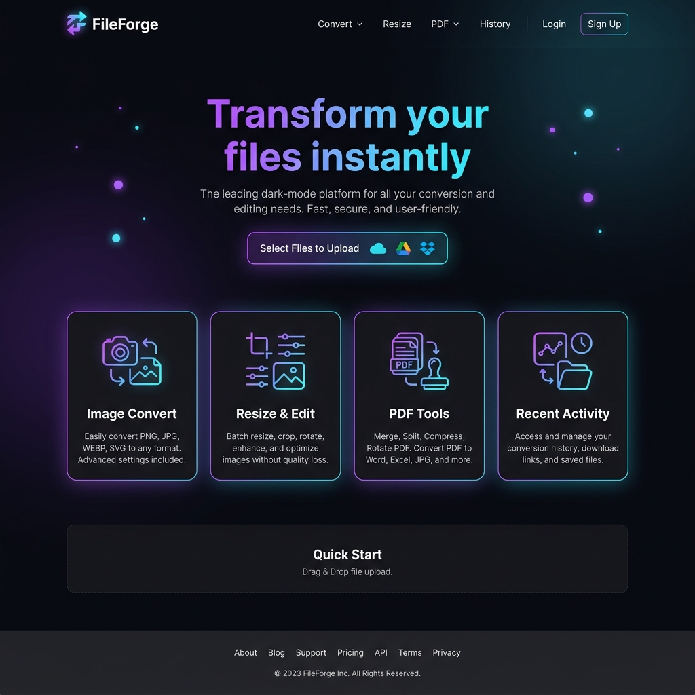
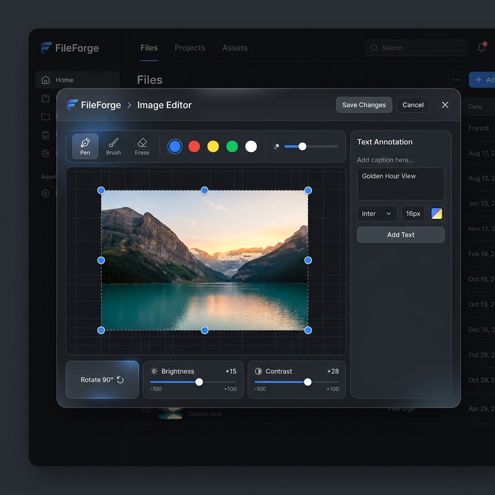
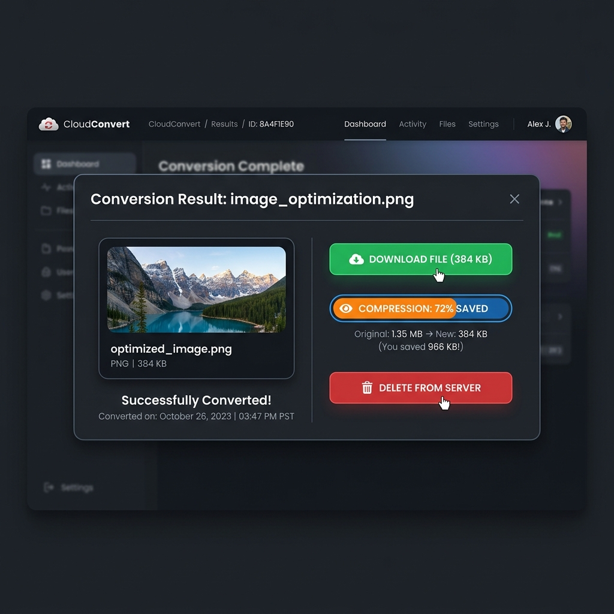

# ⚡ FileForge — Secure Image & PDF Processing SaaS Platform

FileForge is a high-performance, full-stack file processing platform built with **FastAPI (Python 3.11)**, **Next.js 14 (TypeScript)**, **MongoDB Atlas**, **Tailwind CSS**, **Pillow**, and **PyMuPDF**.

It provides military-grade security, instant file format conversions, binary-search compression, interactive image editing, post-conversion live previews, and automated memory/storage cleanup.

---

## 🌟 Key Features

### 🖼️ Image Processing Engine
- **Multi-Format Conversion**: Seamlessly convert between `JPEG`, `PNG`, `WebP`, `GIF`, `BMP`, `TIFF`, and `ICO`.
- **Pixel Dimension Resizing**: Scale width & height with optional aspect-ratio lock.
- **Target File Size Compression (KB)**: Binary-search quality adjustment automatically compresses images under an exact target KB limit.
- **EXIF Metadata Stripping**: Strips privacy/GPS metadata automatically from output files.

### 📄 PDF Processing Engine
- **PDF Compression**: Reduce PDF storage size using PyMuPDF stream deflation and raster image re-compression.
- **PDF to Images**: Convert PDF pages into high-DPI `JPEG`, `PNG`, or `WebP` images packaged in a downloadable `ZIP` archive.

### 🎨 Interactive Canvas & Image Editor (`CanvasEditor`)
- **Freehand Pen & Brush**: Draw and annotate directly on uploaded images with custom colors & stroke width sliders.
- **Visual Crop Box**: Drag & drop a crop selection box to crop exact regions.
- **Canvas Resize**: Change pixel dimensions directly on the interactive canvas.
- **Text Watermarking**: Stamp text overlays anywhere on the canvas.
- **Image Adjustments**: Live brightness, contrast, 90° rotation, and horizontal/vertical flips.

### 👁️ Post-Conversion Live Previews & Output Naming
- **Inline Blob Previews**: Converted images display live in the UI immediately after processing via secure Blob fetching.
- **Custom Output Filenames**: Every processed file is saved with the original file stem, suffix, and timestamp:
  - Format: `[original_stem]_fileforge_[YYYYMMDD_HHMMSS].[extension]`
  - Example: `photo_fileforge_20260730_071530.webp`

### 🛡️ Security & Auto-Cleanup
- **Real Magic-Byte MIME Validation**: Uses `python-magic` to inspect file signatures — extension spoofing is rejected.
- **UUID File Isolation**: Disk files are saved with randomized UUIDs to prevent directory traversal attacks.
- **Tiered Expiry & Memory Cleanup**:
  - **Anonymous IP Tier**: 30-minute file retention.
  - **Authenticated Tier**: 24-hour file history.
  - **Post-Download Acceleration**: Accelerated deletion 5 minutes after initial download.
  - **Manual Delete from Server**: Users can click "Delete from Server" to purge files instantly.

---

## 📸 Screen Tour & Visual Walkthrough

### ⚡ 1. Modern Dark-Mode Homepage & Tool Hub
The main dashboard provides access to Image Convert, Resize & Compress, PDF Tools, and History.



---

### 🎨 2. Interactive Canvas Editor (`CanvasEditor.tsx`)
Before converting or downloading, users can open the interactive canvas modal to draw with pen, crop regions visually, scale dimensions, add text watermarks, adjust brightness/contrast, or rotate & flip images.



---

### 👁️ 3. Post-Conversion Live Preview, Date/Time & Server Purging
Once processing finishes, the UI instantly renders a live preview of the output file, displays the exact UTC conversion date and timestamp, shows expected compression size calculations, and provides one-click **"Delete from Server"** purging.



---

## 🏗️ Project Architecture

```
FileForge/
├── backend/                  # FastAPI Application (Python 3.11)
│   ├── app/
│   │   ├── config/           # Settings & pydantic configuration
│   │   ├── core/             # Security, magic-byte MIME validation, JWT auth
│   │   ├── db/               # MongoDB Async client (Motor)
│   │   ├── models/           # FileJob & User Pydantic/MongoDB schemas
│   │   ├── routers/          # API endpoints (image, pdf, auth, history)
│   │   └── services/         # Processing pipelines (Pillow, PyMuPDF, APScheduler)
│   ├── build.sh              # Production build script for cloud hosts
│   ├── requirements.txt      # Python dependencies
│   └── .env.example          # Environment variables template
│
└── frontend/                 # Next.js 14 Application (TypeScript + Tailwind CSS)
    ├── app/                  # App Router pages (/convert, /resize, /pdf, /history)
    ├── components/           # UI Components (DropZone, ResultPanel, CanvasEditor)
    ├── lib/                  # Axios API client, Auth Context, Types
    ├── netlify.toml          # Netlify Next.js plugin configuration
    └── .env.example          # Frontend environment variables template
```

---

## ⚡ Quick Start Guide

### 1. Backend Setup (FastAPI)

```powershell
cd D:\MASAI\FileForge\backend

# Create virtual environment
python -m venv venv
.\venv\Scripts\activate

# Install dependencies
pip install -r requirements.txt

# Start backend server
.\venv\Scripts\python.exe -m uvicorn app.main:app --reload --port 8000
```

- **Backend API**: `http://localhost:8000`
- **Swagger Interactive Docs**: `http://localhost:8000/docs`
- **Health Check**: `http://localhost:8000/api/health`

### 2. Frontend Setup (Next.js)

```powershell
cd D:\MASAI\FileForge\frontend

# Install dependencies
npm install

# Start development server
npm run dev
```

- **Frontend App**: `http://localhost:3000`

---

## 🔌 API Endpoints Summary

| Method | Endpoint | Description |
|--------|----------|-------------|
| `POST` | `/api/image/convert` | Convert image to JPG, PNG, WebP, GIF, BMP, TIFF, ICO |
| `POST` | `/api/image/resize` | Resize by dimensions (px) or target file size (KB) |
| `POST` | `/api/image/edit` | Crop, rotate, and apply filters to images |
| `POST` | `/api/pdf/compress` | Compress PDF file size with image re-compression |
| `POST` | `/api/pdf/convert` | Convert PDF pages into images (ZIP download) |
| `GET` | `/api/download/{job_id}` | Download processed file (attachment headers) |
| `GET` | `/api/preview/{job_id}` | Inline file preview stream for browser UI |
| `DELETE` | `/api/file/{job_id}` | Immediately purge input & output files from server storage |
| `GET` | `/api/history` | Get paginated conversion history & expiry timers |
| `POST` | `/api/auth/register` | Register new user account |
| `POST` | `/api/auth/login` | Login user & receive JWT bearer token |

---

## 🚀 Deployment Guide

### Backend Deployment (Render.com)
- **Root Directory**: `backend`
- **Build Command**: `chmod +x build.sh && ./build.sh`
- **Start Command**: `./venv/bin/python -m uvicorn app.main:app --host 0.0.0.0 --port $PORT`
- **Environment Variables**:
  - `PYTHON_VERSION`: `3.11.9`
  - `MONGO_URI`: `mongodb+srv://...`
  - `JWT_SECRET`: `<32-char-random-hex-key>`

### Frontend Deployment (Netlify / Vercel)
- **Root Directory**: `frontend`
- **Build Command**: `npm run build`
- **Publish Directory**: `frontend/.next`
- **Environment Variables**:
  - `NEXT_PUBLIC_API_URL`: `https://your-backend.onrender.com`

---

## 📜 License & Author

- **Project**: FileForge SaaS
- **Author**: FileForge Team
